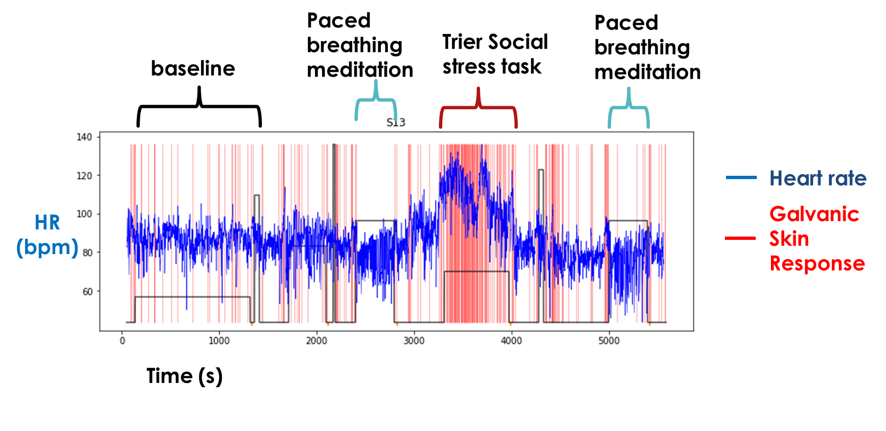
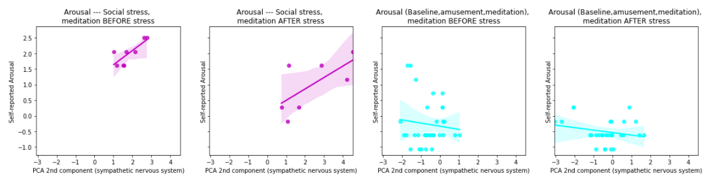
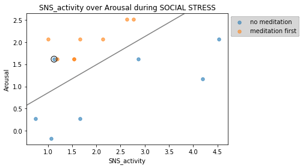

# Springboard_Capstone2

The publicly available Wearables Stress and Affect Detection (WESAD) dataset provides physiological and psychological measurements from 15 human subjects. Half the subjects did a comedy-viewing task and a meditation task before social stress, while half only did those after social stress.

Overall, it appears meditation buffered against hyperactivity of the sympathetic nervous system (SNS), allowing high subjective arousal while keeping sympathetic tone relatively low. (A t-test on this 2-dimensional representation of arousal controlled for SNS activity revealed an effect of meditation/amusement with a p-value of p=0.002)
